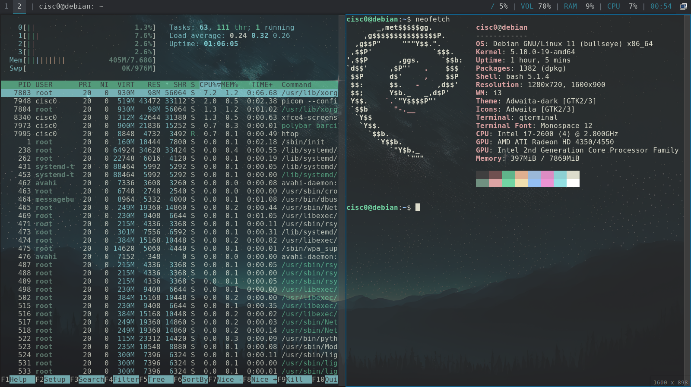

#### Dot_files
My config for GNU/Linux OS

Setup for production environment

Feel free to use it

![linux-shield]

#### Packages
i3, polybar, rofi, xrandr, picom, feh, qt5ct, lxappearence, qterminal, fish, omf

#### Screens

<!-- LINUX  shield-->
[linux-shield]: https://img.shields.io/badge/Debian-A81D33?style=for-the-badge&logo=debian&logoColor=white
